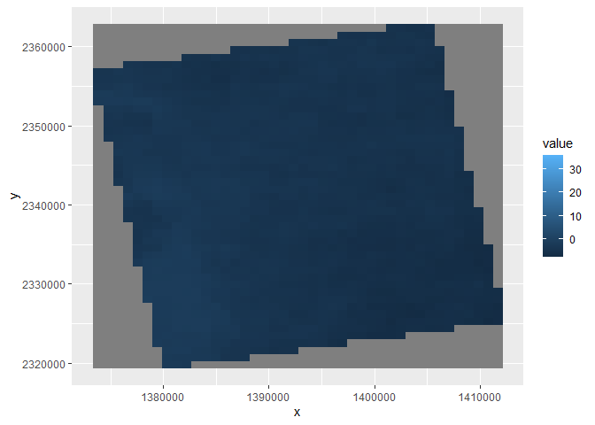

Case Study 10
================
Yvonne Huang
August 1, 2020

# library

``` r
library(raster)
```

    ## Warning: package 'raster' was built under R version 4.2.2

    ## Loading required package: sp

``` r
library(rasterVis)
```

    ## Warning: package 'rasterVis' was built under R version 4.2.2

    ## Loading required package: lattice

``` r
library(rgdal)
```

    ## Please note that rgdal will be retired by the end of 2023,
    ## plan transition to sf/stars/terra functions using GDAL and PROJ
    ## at your earliest convenience.
    ## 
    ## rgdal: version: 1.5-32, (SVN revision 1176)
    ## Geospatial Data Abstraction Library extensions to R successfully loaded
    ## Loaded GDAL runtime: GDAL 3.4.3, released 2022/04/22
    ## Path to GDAL shared files: C:/Users/Yvonne/AppData/Local/R/win-library/4.2/rgdal/gdal
    ## GDAL binary built with GEOS: TRUE 
    ## Loaded PROJ runtime: Rel. 7.2.1, January 1st, 2021, [PJ_VERSION: 721]
    ## Path to PROJ shared files: C:/Users/Yvonne/AppData/Local/R/win-library/4.2/rgdal/proj
    ## PROJ CDN enabled: FALSE
    ## Linking to sp version:1.5-0
    ## To mute warnings of possible GDAL/OSR exportToProj4() degradation,
    ## use options("rgdal_show_exportToProj4_warnings"="none") before loading sp or rgdal.

``` r
library(ggmap)
```

    ## Loading required package: ggplot2

    ## Google's Terms of Service: https://cloud.google.com/maps-platform/terms/.

    ## Please cite ggmap if you use it! See citation("ggmap") for details.

``` r
library(tidyverse)
```

    ## ── Attaching packages
    ## ───────────────────────────────────────
    ## tidyverse 1.3.2 ──

    ## ✔ tibble  3.1.8      ✔ dplyr   1.0.10
    ## ✔ tidyr   1.2.1      ✔ stringr 1.4.1 
    ## ✔ readr   2.1.3      ✔ forcats 0.5.2 
    ## ✔ purrr   0.3.5

    ## Warning: package 'dplyr' was built under R version 4.2.2

    ## ── Conflicts ────────────────────────────────────────── tidyverse_conflicts() ──
    ## ✖ tidyr::extract() masks raster::extract()
    ## ✖ dplyr::filter()  masks stats::filter()
    ## ✖ dplyr::lag()     masks stats::lag()
    ## ✖ dplyr::select()  masks raster::select()

``` r
library(knitr)

# New Packages
library(ncdf4) # to import data from netcdf format
```

# Create afolder to hold the downloaded data

``` r
dir.create("data",showWarnings = F) #create a folder to hold the data

lulc_url="https://github.com/adammwilson/DataScienceData/blob/master/inst/extdata/appeears/MCD12Q1.051_aid0001.nc?raw=true"
lst_url="https://github.com/adammwilson/DataScienceData/blob/master/inst/extdata/appeears/MOD11A2.006_aid0001.nc?raw=true"
```

# download them

``` r
download.file(lulc_url,destfile="data/MCD12Q1.051_aid0001.nc", mode="wb")
download.file(lst_url,destfile="data/MOD11A2.006_aid0001.nc", mode="wb")

lulc=stack("data/MCD12Q1.051_aid0001.nc",varname="Land_Cover_Type_1")
```

    ## [1] ">>>> WARNING <<<  attribute latitude_of_projection_origin is an 8-byte value, but R"
    ## [1] "does not support this data type. I am returning a double precision"
    ## [1] "floating point, but you must be aware that this could lose precision!"
    ## [1] ">>>> WARNING <<<  attribute longitude_of_central_meridian is an 8-byte value, but R"
    ## [1] "does not support this data type. I am returning a double precision"
    ## [1] "floating point, but you must be aware that this could lose precision!"
    ## [1] ">>>> WARNING <<<  attribute longitude_of_projection_origin is an 8-byte value, but R"
    ## [1] "does not support this data type. I am returning a double precision"
    ## [1] "floating point, but you must be aware that this could lose precision!"
    ## [1] ">>>> WARNING <<<  attribute straight_vertical_longitude_from_pole is an 8-byte value, but R"
    ## [1] "does not support this data type. I am returning a double precision"
    ## [1] "floating point, but you must be aware that this could lose precision!"
    ## [1] ">>>> WARNING <<<  attribute false_easting is an 8-byte value, but R"
    ## [1] "does not support this data type. I am returning a double precision"
    ## [1] "floating point, but you must be aware that this could lose precision!"
    ## [1] ">>>> WARNING <<<  attribute false_northing is an 8-byte value, but R"
    ## [1] "does not support this data type. I am returning a double precision"
    ## [1] "floating point, but you must be aware that this could lose precision!"

    ## Warning in .getCRSfromGridMap4(atts): cannot process these parts of the crs:
    ## _CoordinateAxisTypes=GeoX GeoY
    ## horizontal_datum_name=WGS84

    ## Warning in .doTime(r, nc, zvar, dim3): assuming a standard calender:julian

    ## Warning in .doTime(st, nc, zvar, dim3): assuming a standard calender:julian

``` r
lst=stack("data/MOD11A2.006_aid0001.nc",varname="LST_Day_1km")
```

    ## [1] ">>>> WARNING <<<  attribute latitude_of_projection_origin is an 8-byte value, but R"
    ## [1] "does not support this data type. I am returning a double precision"
    ## [1] "floating point, but you must be aware that this could lose precision!"
    ## [1] ">>>> WARNING <<<  attribute longitude_of_central_meridian is an 8-byte value, but R"
    ## [1] "does not support this data type. I am returning a double precision"
    ## [1] "floating point, but you must be aware that this could lose precision!"
    ## [1] ">>>> WARNING <<<  attribute longitude_of_projection_origin is an 8-byte value, but R"
    ## [1] "does not support this data type. I am returning a double precision"
    ## [1] "floating point, but you must be aware that this could lose precision!"
    ## [1] ">>>> WARNING <<<  attribute straight_vertical_longitude_from_pole is an 8-byte value, but R"
    ## [1] "does not support this data type. I am returning a double precision"
    ## [1] "floating point, but you must be aware that this could lose precision!"
    ## [1] ">>>> WARNING <<<  attribute false_easting is an 8-byte value, but R"
    ## [1] "does not support this data type. I am returning a double precision"
    ## [1] "floating point, but you must be aware that this could lose precision!"
    ## [1] ">>>> WARNING <<<  attribute false_northing is an 8-byte value, but R"
    ## [1] "does not support this data type. I am returning a double precision"
    ## [1] "floating point, but you must be aware that this could lose precision!"

    ## Warning in .getCRSfromGridMap4(atts): cannot process these parts of the crs:
    ## _CoordinateAxisTypes=GeoX GeoY
    ## horizontal_datum_name=WGS84

    ## Warning in .doTime(r, nc, zvar, dim3): assuming a standard calender:julian

    ## Warning in .doTime(st, nc, zvar, dim3): assuming a standard calender:julian

``` r
# plot(lulc)
lulc=lulc[[13]]


Land_Cover_Type_1 = c(
  Water = 0, 
  `Evergreen Needleleaf forest` = 1, 
  `Evergreen Broadleaf forest` = 2,
  `Deciduous Needleleaf forest` = 3, 
  `Deciduous Broadleaf forest` = 4,
  `Mixed forest` = 5, 
  `Closed shrublands` = 6,
  `Open shrublands` = 7,
  `Woody savannas` = 8, 
  Savannas = 9,
  Grasslands = 10,
  `Permanent wetlands` = 11, 
  Croplands = 12,
  `Urban & built-up` = 13,
  `Cropland/Natural vegetation mosaic` = 14, 
  `Snow & ice` = 15,
  `Barren/Sparsely vegetated` = 16, 
  Unclassified = 254,
  NoDataFill = 255)

lcd=data.frame(
  ID=Land_Cover_Type_1,
  landcover=names(Land_Cover_Type_1),
  col=c("#000080","#008000","#00FF00", "#99CC00","#99FF99", "#339966", "#993366", "#FFCC99", "#CCFFCC", "#FFCC00", "#FF9900", "#006699", "#FFFF00", "#FF0000", "#999966", "#FFFFFF", "#808080", "#000000", "#000000"),
  stringsAsFactors = F)
# colors from https://lpdaac.usgs.gov/about/news_archive/modisterra_land_cover_types_yearly_l3_global_005deg_cmg_mod12c1
kable(head(lcd))
```

|                             |  ID | landcover                   | col      |
|:----------------------------|----:|:----------------------------|:---------|
| Water                       |   0 | Water                       | \#000080 |
| Evergreen Needleleaf forest |   1 | Evergreen Needleleaf forest | \#008000 |
| Evergreen Broadleaf forest  |   2 | Evergreen Broadleaf forest  | \#00FF00 |
| Deciduous Needleleaf forest |   3 | Deciduous Needleleaf forest | \#99CC00 |
| Deciduous Broadleaf forest  |   4 | Deciduous Broadleaf forest  | \#99FF99 |
| Mixed forest                |   5 | Mixed forest                | \#339966 |

# convert to raster (easy)

``` r
lulc=as.factor(lulc)
```

# update the RAT with a left join

``` r
levels(lulc)=left_join(levels(lulc)[[1]],lcd)
```

    ## Joining, by = "ID"

``` r
offs(lst)=-273.15
plot(lst[[1:10]])
```

<!-- -->

``` r
tdates=names(lst)%>%
  sub(pattern="X",replacement="")%>%
  as.Date("%Y.%m.%d")

names(lst)=1:nlayers(lst)
lst=setZ(lst,tdates)
```

# PART 1

``` r
lw = SpatialPoints(data.frame(x= -78.791547,y=43.007211))
projection(lw) <- "+proj=longlat"
lw = spTransform(lw, CRSobj = crs(lst, asText = TRUE))
lst_transpose <- t(raster::extract(lst,lw,buffer=1000,fun=mean,na.rm=T) )

part1 <- data.frame(getZ(lst), lst_transpose)
colnames(part1) <- c("date", "value") 

graphics.off()
ggplot(part1, aes(date, value))+
  geom_point()+
  geom_smooth(n = 100, span = 0.01)
```

    ## `geom_smooth()` using method = 'loess' and formula 'y ~ x'

    ## Warning: Removed 82 rows containing non-finite values (stat_smooth).

    ## Warning in simpleLoess(y, x, w, span, degree = degree, parametric =
    ## parametric, : k-d tree limited by memory. ncmax= 729

    ## Warning in predLoess(object$y, object$x, newx = if
    ## (is.null(newdata)) object$x else if (is.data.frame(newdata))
    ## as.matrix(model.frame(delete.response(terms(object)), : k-d tree limited by
    ## memory. ncmax= 729

    ## Warning: Removed 82 rows containing missing values (geom_point).

# PART2

``` r
tmonth <- as.numeric(format(getZ(lst),"%m"))
lst_month <- stackApply(lst,tmonth , fun = mean)
names(lst_month)=month.name
gplot(lst_month)+
  geom_raster(aes(fill = value))
```

<!-- -->

``` r
cellStats(lst_month,mean)
```

    ##   January  February     March     April       May      June      July    August 
    ## -2.127507  8.710271 18.172077 23.173591 26.990005 28.840144 27.358260 22.927727 
    ## September   October  November  December 
    ## 15.477510  8.329881  0.586179 -4.754134

\#PART 3

``` r
lulc2 = resample(lulc, lst, method="ngb")
lcds1 = cbind.data.frame(
  values(lst_month),
  ID=values(lulc2[[1]]))%>%
  na.omit() %>%
  gather(key='month',value='value',-ID) %>%
  mutate(ID=as.numeric(ID)) %>%
  mutate(month=factor(month,levels=month.name,ordered=T)) %>%
  inner_join(lcd) %>%
  filter(landcover%in%c("Urban & built-up","Deciduous Broadleaf forest"))%>%
ggplot()+
  geom_point(aes(month,value))+
  theme_bw()+
  facet_wrap(~landcover)
```

    ## Joining, by = "ID"
